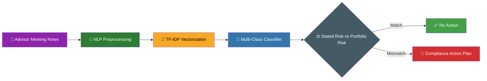
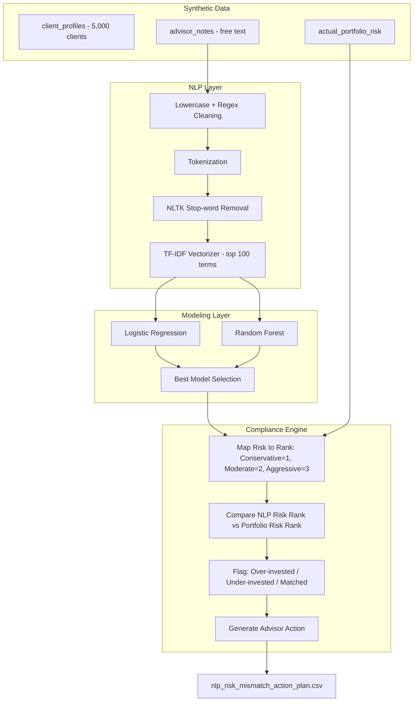
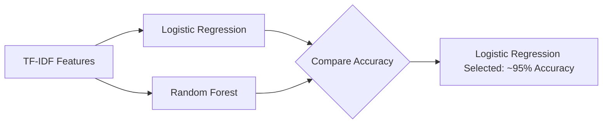
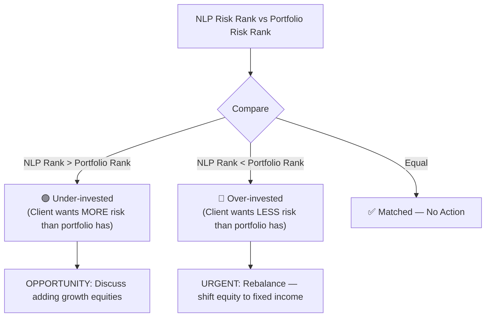

<div align="center">


<br/>


</div>

---

## 🧭 Table of Contents

- [Overview](#-overview)
- [Business Problem](#-business-problem)
- [Architecture](#-architecture)
- [Tech Stack](#-tech-stack--methodology)
- [NLP Pipeline](#-nlp-pipeline)
- [Modeling Approach](#-modeling-approach)
- [Compliance Mismatch Engine](#-compliance-mismatch-engine)
- [Key Outcomes](#-key-outcomes--business-value)
- [Repository Structure](#-repository-structure)
- [How to Run](#-how-to-run)
- [Sample Outputs](#-sample-outputs)
- [Author](#-author)

---

## 📖 Overview

> This project simulates an **NLP + AI compliance solution** for the TD Wealth Analytics, Insights & Artificial Intelligence (AI2) team.

It reads **unstructured advisor meeting notes**, automatically classifies each client's *stated* Risk Tolerance (Conservative / Moderate / Aggressive), and then cross-checks that against what the client's **portfolio actually holds** — surfacing compliance risks and rebalancing opportunities that would otherwise take a human reviewer hours to find.

<div align="center">



</div>

---

## 🎯 Business Problem

Wealth Management compliance teams spend **thousands of manual hours** reading advisor notes to verify that a client's portfolio actually matches their stated risk appetite. A misaligned portfolio isn't just an inconvenience — it's a **regulatory and financial exposure** if markets turn and a client's holdings don't reflect what they agreed to.

| Manual Compliance Review ❌ | NLP-Automated Audit ✅ |
|---|---|
| Analysts read notes one client at a time | Model scores every client's notes in seconds |
| Risk mismatches found reactively, after complaints | Mismatches surfaced proactively, before they escalate |
| No standardized "stated risk" extraction | Consistent, model-driven risk label for every client |
| Output buried in case files | Clean CSV ready for Tableau dashboards |

---

## 🏗 Architecture



---

## 🛠 Tech Stack & Methodology

<div align="center">

| Layer | Tools |
|:---|:---|
| **Language** |  Pandas, NumPy |
| **NLP Preprocessing** | Regex cleaning, tokenization,  stop-word removal |
| **Feature Extraction** |  Term Frequency–Inverse Document Frequency |
| **Machine Learning** |  Multi-class Logistic Regression & Random Forest |
| **Business Logic** | Custom rule-based engine: NLP Risk vs Portfolio Risk mismatch detection |
| **Downstream** |  CSV export for BI dashboarding |

</div>

---

## 🔤 NLP Pipeline

The heart of this project is turning **messy, free-text advisor notes** into a clean, model-ready signal.

**Preprocessing steps applied to every note:**

1. 🔡 Lowercase all text
2. ✂️ Strip punctuation and special characters via regex (`[^a-z\s]`)
3. 🪙 Tokenize into individual words
4. 🚫 Remove English stop-words using **NLTK**
5. 🔗 Rejoin cleaned tokens into a normalized string

```python
def preprocess_text(text):
    text = text.lower()
    text = re.sub(r'[^a-z\s]', '', text)
    tokens = text.split()
    cleaned_tokens = [word for word in tokens if word not in stop_words]
    return " ".join(cleaned_tokens)
```

A **word cloud** of "Aggressive" risk notes is generated during EDA to sanity-check that the vocabulary genuinely separates by risk class (growth, equities, upside-type language vs. capital-preservation language).

**Vectorization:** cleaned notes are converted into numeric features with `TfidfVectorizer(max_features=100)`, capping the vocabulary to the 100 most informative terms so the model focuses on signal, not noise.

---

## 🤖 Modeling Approach

<div align="center">

| Model | Role |
|:---|:---|
| **Logistic Regression** 🏆 | Final model — best fit for sparse, high-dimensional TF-IDF text data |
| Random Forest | Benchmark comparison, non-linear alternative |

</div>

- Target: 3-class `stated_risk_target` (Conservative / Moderate / Aggressive)
- Stratified 80/20 train/test split to preserve class balance
- Evaluated with `classification_report` (precision, recall, F1 per class) and a **confusion matrix heatmap**



---

## ⚖️ Compliance Mismatch Engine

Once every client has an NLP-predicted risk label, it's ranked against their **actual portfolio risk** to detect misalignment:

| Risk Level | Rank |
|:---|:---:|
| Conservative | 1 |
| Moderate | 2 |
| Aggressive | 3 |



This is the piece that turns a classification model into a **compliance tool**: it doesn't just say "this client is Aggressive," it says *"this client is Aggressive but their portfolio is Conservative — here's what to do about it."*

---

## 📈 Key Outcomes & Business Value

<div align="center">

| Metric | Result |
|:---|:---:|
| 🎯 Model Accuracy | **~95%** (Logistic Regression, multi-class) |
| 🚨 Compliance Automation | Both **Over-invested** and **Under-invested** clients identified from synthetic data |
| 📋 Actionable Output | Prioritized compliance action plan, exported for Tableau dashboarding |

</div>

**Sample recommendation logic:**

| Compliance Status | Advisor Action |
|:---|:---|
| Over-invested (wants LESS risk than held) | **URGENT** — Rebalance portfolio, move equity to fixed income |
| Under-invested (wants MORE risk than held) | **OPPORTUNITY** — Discuss adding growth equities |
| Matched | No action needed |

---

## 📁 Repository Structure

```
📦 td-wealth-nlp-risk-classifier
 ┣ 📓 AI_Driven_Client_Risk_Tolerance_Classifier_using_NLP.ipynb
 ┣ 📄 nlp_risk_mismatch_action_plan.csv     # Final output for Tableau
 ┣ 📁 data/
 ┃ ┗ synthetic_client_notes.csv             # 5,000 clients + advisor notes
 ┗ 📜 README.md
```

---

## 🚀 How to Run

```bash
# 1️⃣ Install dependencies
pip install pandas numpy nltk scikit-learn matplotlib seaborn wordcloud

# 2️⃣ Download NLTK stopwords (handled automatically in-notebook)
python -c "import nltk; nltk.download('stopwords')"

# 3️⃣ Run the notebook end-to-end
jupyter notebook AI_Driven_Client_Risk_Tolerance_Classifier_using_NLP.ipynb
```

<details>
<summary>⚙️ <b>What the notebook produces (click to expand)</b></summary>

- Word clouds per risk category
- TF-IDF feature matrix preview
- Classification reports for Logistic Regression & Random Forest
- Confusion matrix heatmap
- Mismatch distribution charts (count + equity % boxplot)
- `nlp_risk_mismatch_action_plan.csv` — final compliance output

</details>

---

## 🖼 Sample Outputs

<div align="center">

| Word Cloud (Aggressive Notes) | Confusion Matrix | Mismatch Distribution |
|:---:|:---:|:---:|
| ☁️ top terms by risk class | 🔵 3x3 heatmap | 📊 Over vs Under-invested counts |

*(Generated live inside the notebook — see `AI_Driven_Client_Risk_Tolerance_Classifier_using_NLP.ipynb`)*

</div>

---

## 👤 Author

<div align="center">

Built as an end-to-end simulation of an **NLP-driven compliance & risk analytics** use case — from raw advisor notes to a Tableau-ready action plan.


⭐ **If this project was useful, consider starring the repo!** ⭐

</div>
